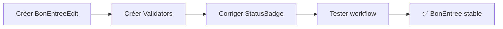

# 📊 Analyse Complète du Projet KCCMaterialFlow

**Date d'analyse:** 28 janvier 2026  
**Version:** Post-simplification des entités  

---

## 📋 Table des Matières

1. [Vue d'ensemble du projet](#1-vue-densemble-du-projet)
2. [Architecture actuelle](#2-architecture-actuelle)
3. [État du module BonEntree](#3-état-du-module-bonentree)
4. [Problèmes identifiés](#4-problèmes-identifiés)
5. [Pages colorées en jaune - Explication](#5-pages-colorées-en-jaune---explication)
6. [Recommandations avant de continuer](#6-recommandations-avant-de-continuer)
7. [Checklist de qualité](#7-checklist-de-qualité)
8. [Plan d'action](#8-plan-daction)

---

## 1. Vue d'ensemble du projet

### Description
Application Blazor Server .NET 10 modulaire pour la gestion des mouvements de matériels (BEM/BSM) sur un site industriel, avec workflow d'approbation multi-niveaux.

### Technologies
| Composant | Technologie |
|-----------|-------------|
| Framework | .NET 10 / Blazor Server |
| UI | Radzen Blazor |
| ORM | Entity Framework Core |
| Base de données | SQL Server |
| Architecture | Modulaire (plugins) |

### Structure des projets
```
KCCMaterialFlow.sln
├── KCCMaterialFlow.Core          # Noyau partagé (abstractions, DbContext, services)
├── KCCMaterialFlow.Host          # Application hôte Blazor Server
└── Modules/
    ├── KCCMaterialFlow.Module.BonEntree   # ✅ Module principal (en cours)
    ├── KCCMaterialFlow.Module.BonSortie   # ⏳ À développer
    ├── KCCMaterialFlow.Module.Securite    # ⏳ À développer
    └── KCCMaterialFlow.Module.Shared      # Entités partagées (Barriere, Utilisateur)
```

---

## 2. Architecture actuelle

### Modèle de données (Post-simplification)

#### Hiérarchie des entités (TPH - Table Per Hierarchy)
```
Bon (abstraite) - 8 champs
├── BonEntree - 8 champs spécifiques
└── BonSortie - À définir
    ├── Materiel[] - 5 champs
    ├── Approbation[] - 4 champs
    └── ItinerairePrevu[] - 2 champs
```

#### Entité Bon (Base)
| Propriété | Type | Description |
|-----------|------|-------------|
| IdBon | int | Clé primaire |
| NumeroReference | string(20) | BEM-YYYY-NNNNNN |
| DateCreation | DateTime | Auto-généré |
| DateExpiration | DateTime | Validité |
| StatutActuel | string(50) | Statut workflow |
| Destination | string(200) | TO |
| Provenance | string(200) | FROM |
| Description | string(1000) | Observations |
| Quantite | int | Total matériels |

#### Entité BonEntree
| Propriété | Type | Description |
|-----------|------|-------------|
| NumeroContrat | string(50)? | CONTRACT NUMBER |
| NomCompagnie | string(200) | COMPANY NAME |
| EmailContractant | string(200)? | CONTRACTOR EMAIL |
| SiteManager | string(200) | SITE MANAGER |
| HostDepartment | string(100) | HOST DEPARTMENT |
| ReasonOnSite | string(1000) | REASON ON SITE |
| NomEscorteur | string(200) | NOM ESCORTEUR |
| FonctionEscorteur | string(150)? | FONCTION |

#### Entité Materiel
| Propriété | Type | Description |
|-----------|------|-------------|
| IdMateriel | int | Clé primaire |
| BonId | int | FK vers Bon |
| CodeProduitSerial | string(100) | Code/Série |
| Designation | string(300) | Description |
| Quantite | decimal | Quantité |
| Provenance | string(200)? | FROM |
| Destination | string(200)? | TO |

### Gestion des statuts
**Changement majeur:** Les statuts sont maintenant des `string` au lieu de l'enum `BonStatut`.

| Statut | Description |
|--------|-------------|
| `Draft` | Brouillon |
| `PendingSup` | En attente Superviseur |
| `PendingDG` | En attente DG |
| `PendingOPJ` | En attente OPJ |
| `Approved` | Approuvé |
| `Rejected` | Rejeté |
| `InTransit` | En transit |
| `Completed` | Terminé |
| `Cancelled` | Annulé |

---

## 3. État du module BonEntree

### Fichiers du module

| Dossier/Fichier | État | Description |
|-----------------|------|-------------|
| **Entities/** | ✅ | Simplifiées selon UML |
| `Bon.cs` | ✅ | 8 champs |
| `BonEntree.cs` | ✅ | 8 champs |
| `Materiel.cs` | ✅ | 5 champs |
| `Approbation.cs` | ✅ | 4 champs |
| `ItinerairePrevu.cs` | ✅ | 2 champs |
| **Configurations/** | ✅ | EF Core mappings |
| **DTOs/** | ✅ | Simplifiés |
| **Repositories/** | ✅ | Implémentation EF |
| **Services/** | ✅ | Logique métier |
| **Pages/** | ⚠️ | Fonctionnelles mais warnings IDE |
| `BonEntreeList.razor` | ✅ | Liste avec stats |
| `BonEntreeNew.razor` | ⚠️ | Création - warnings IDE |
| `BonEntreeView.razor` | ⚠️ | Détails - warnings IDE |
| `BonEntreePrint.razor` | ✅ | Impression SEC-FM-141(B) |
| `BonEntreeEdit.razor` | ❌ | **MANQUANT** |
| **Validators/** | ❌ | Dossier vide |
| **Mappings/** | ✅ | AutoMapper simplifié |

### Statistiques de code
- **Entités:** 5 fichiers, ~250 lignes
- **Services:** 2 fichiers, ~800 lignes
- **Repository:** 2 fichiers, ~500 lignes
- **Pages Razor:** 4 fichiers, ~600 lignes
- **DTOs:** 5 fichiers, ~300 lignes

---

## 4. Problèmes identifiés

### 🔴 Critiques

#### 4.1 Page BonEntreeEdit manquante
La page d'édition a été supprimée lors de la simplification mais n'a pas été recréée.
```
Impact: Les utilisateurs ne peuvent pas modifier un bon existant.
Solution: Créer BonEntreeEdit.razor + .cs
```

#### 4.2 Dossier Validators vide
Aucune validation FluentValidation n'est présente.
```
Impact: Risque de données invalides en base.
Solution: Créer CreateBonEntreeRequestValidator, UpdateBonEntreeRequestValidator
```

### 🟠 Importants

#### 4.3 Enum BonStatut encore utilisé dans Core
L'enum `BonStatut` existe toujours dans `Core/Enums/` et est utilisé par:
- `StatusBadge.razor` (Core)
- `WorkflowButtons.razor` (Core)
- `ApprovalHistory.razor` (Core)
- `WorkflowService.cs` (Core)

```
Impact: Incohérence entre les modules (string) et Core (enum).
Solution: Migrer les composants Core vers string OU garder enum et convertir.
```

#### 4.4 Entités non créées pour BonSortie
Le module BonSortie a un dossier Entities vide.
```
Impact: Le module BonSortie n'est pas fonctionnel.
Solution: Créer BonSortie.cs héritant de Bon
```

### 🟡 Mineurs

#### 4.5 Avertissements IDE (pages jaunes)
Certaines pages Razor affichent des erreurs dans l'IDE mais compilent correctement.
```
Impact: Expérience développeur dégradée.
Cause: Voir section 5 pour explication détaillée.
```

#### 4.6 Imports non utilisés
Certains fichiers importent `KCCMaterialFlow.Core.Enums` mais n'utilisent plus les enums.
```
Impact: Code superflu.
Solution: Nettoyer les imports après stabilisation.
```

---

## 5. Pages colorées en jaune - Explication

### Cause principale
Les **erreurs jaunes/rouges** que vous voyez dans VS Code pour `BonEntreeView.razor` et `BonEntreeNew.razor` sont des **erreurs de l'IDE (OmniSharp/Razor Language Server)**, pas des erreurs de compilation.

### Preuve
```bash
dotnet build KCCMaterialFlow.sln
# Résultat: Build succeeded - 0 Warning(s), 0 Error(s)
```

### Pourquoi cela arrive ?

1. **Cache Razor corrompu**
   Le serveur de langage Razor de VS Code maintient un cache qui peut devenir désynchronisé.

2. **Fichiers recréés rapidement**
   Lors de la session de refactoring, nous avons supprimé et recréé plusieurs fichiers. VS Code n'a pas toujours le temps de se resynchroniser.

3. **Imports non résolus par l'IDE**
   Les fichiers `_Imports.razor` sont correctement configurés mais l'IDE ne les recharge pas toujours.

### Solutions

#### Solution 1: Redémarrer VS Code
```
1. Fermer VS Code
2. Supprimer le dossier .vs/ s'il existe
3. Rouvrir VS Code
```

#### Solution 2: Forcer le rechargement Razor
```
1. Ctrl+Shift+P
2. Taper "Razor: Restart Razor Language Server"
3. Ou "Developer: Reload Window"
```

#### Solution 3: Supprimer les caches
```powershell
# Dans le dossier src/
Remove-Item -Recurse -Force "**/obj", "**/bin"
dotnet build
```

#### Solution 4: Vérifier l'extension Razor
Assurez-vous que l'extension "C# Dev Kit" ou "C#" est à jour.

---

## 6. Recommandations avant de continuer

### ✅ Checklist obligatoire avant BonSortie

| # | Action | Priorité | Temps estimé |
|---|--------|----------|--------------|
| 1 | Créer `BonEntreeEdit.razor` | 🔴 Haute | 2h |
| 2 | Créer les Validators FluentValidation | 🔴 Haute | 1h |
| 3 | Corriger les composants Core (StatusBadge, etc.) pour accepter string | 🟠 Moyenne | 2h |
| 4 | Tester le workflow complet BonEntree (Create → Approve → Print) | 🔴 Haute | 1h |
| 5 | Appliquer la migration EF si ce n'est pas fait | 🔴 Haute | 10min |
| 6 | Documenter les conventions de statuts (constantes) | 🟡 Basse | 30min |

### 📐 Conventions à établir

#### Convention 1: Constantes de statuts
Créer une classe statique pour éviter les "magic strings":
```csharp
// Dans Core/Constants/StatutConstants.cs
public static class BonStatuts
{
    public const string Draft = "Draft";
    public const string PendingSup = "PendingSup";
    public const string PendingDG = "PendingDG";
    public const string PendingOPJ = "PendingOPJ";
    public const string Approved = "Approved";
    public const string Rejected = "Rejected";
    public const string InTransit = "InTransit";
    public const string Completed = "Completed";
    public const string Cancelled = "Cancelled";
}
```

#### Convention 2: Nommage des références
```
BEM-YYYY-NNNNNN  → Bon d'Entrée Matériel
BSM-YYYY-NNNNNN  → Bon de Sortie Matériel
```

#### Convention 3: Structure des modules
Chaque module doit avoir:
```
Module/
├── Entities/           # Modèles EF
│   └── Configurations/ # IEntityTypeConfiguration
├── DTOs/               # Data Transfer Objects
├── Repositories/       # Accès données
├── Services/           # Logique métier
├── Validators/         # FluentValidation
├── Pages/              # Composants Razor
│   └── _Imports.razor
├── Mappings/           # AutoMapper profiles
└── ModuleInfo.cs       # Métadonnées du module
```

---

## 7. Checklist de qualité

### Avant chaque nouveau module

- [ ] **Diagramme UML** des entités à jour
- [ ] **Formulaire de référence** (ex: SEC-FM-141) analysé
- [ ] **Champs exacts** définis (pas de colonnes superflues)
- [ ] **Statuts** listés et documentés
- [ ] **Relations EF** configurées (FK, navigation properties)

### Après création du module

- [ ] **Build sans erreurs**
- [ ] **Migrations EF générées** et appliquées
- [ ] **Validators** créés et testés
- [ ] **Pages CRUD complètes** (List, New, Edit, View, Print si applicable)
- [ ] **Tests manuels** du workflow

---

## 8. Plan d'action

### Phase 1: Stabilisation BonEntree (Immédiat)



### Phase 2: Module BonSortie

1. **Analyser le formulaire BSM** (SEC-FM-xxx)
2. **Définir les champs** (probablement similaire à BonEntree)
3. **Créer les entités** (BonSortie héritant de Bon)
4. **Répliquer la structure** du module BonEntree
5. **Ajouter la relation** Materiel ↔ BonSortie (pour traçabilité)

### Phase 3: Module Securite

1. **Gestion des barrières** (scan QR)
2. **Historique des passages**
3. **Tableau de bord sécurité**

---

## 📝 Notes finales

### Ce qui a bien fonctionné
- ✅ Simplification des entités selon UML
- ✅ Architecture modulaire claire
- ✅ Séparation des responsabilités (Repository/Service/Page)
- ✅ Utilisation de Radzen pour l'UI

### Ce qui doit être amélioré
- ⚠️ Définir les schémas **avant** de coder (UML + formulaire papier)
- ⚠️ Créer les **Validators** dès le début
- ⚠️ Maintenir une **cohérence** entre les modules (string vs enum)
- ⚠️ **Documenter** les conventions dans un fichier dédié

### Temps estimé pour stabilisation complète
| Tâche | Temps |
|-------|-------|
| BonEntreeEdit | 2h |
| Validators | 1h |
| Correction composants Core | 2h |
| Tests et debug | 2h |
| **Total** | **~7h** |

---

*Document généré automatiquement - KCCMaterialFlow Analysis Tool*
