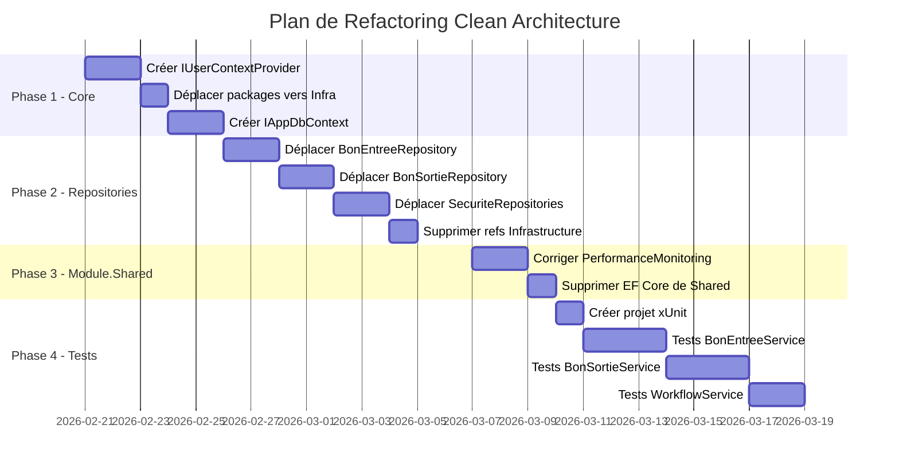

# Plan de Refactoring Clean Architecture - KCCMaterialFlow

> **Date**: 20 février 2026  
> **Version**: 1.0  
> **Priorité**: Critique

---

## 📋 Sommaire des Violations

| # | Violation | Sévérité | Effort |
|---|-----------|----------|--------|
| 1 | Application → Infrastructure (dépendance inversée) | 🔴 Critique | Élevé |
| 2 | Core contient dépendances Infrastructure | 🔴 Critique | Moyen |
| 3 | Couplage Web dans Core (CurrentUserService) | 🟠 Majeur | Moyen |
| 4 | Repositories dans Application (mauvais placement) | 🟠 Majeur | Élevé |
| 5 | Absence de tests unitaires | 🟠 Majeur | Élevé |
| 6 | EF Core dans Module.Shared | 🟡 Mineur | Faible |

---

## 🎯 Phase 1 : Correction des Dépendances Core (Semaine 1)

### 1.1 Créer abstraction IUserContextProvider

**Objectif** : Découpler `CurrentUserService` de `Microsoft.AspNetCore.Http`

**Fichier à créer** : `KCCMaterialFlow.Core\Abstractions\IUserContextProvider.cs`

```csharp
namespace KCCMaterialFlow.Core.Abstractions;

/// <summary>
/// Abstraction pour accéder au contexte utilisateur sans dépendance Web
/// </summary>
public interface IUserContextProvider
{
    /// <summary>Obtient le login de l'utilisateur authentifié</summary>
    string? GetUserLogin();
    
    /// <summary>Obtient le nom d'affichage</summary>
    string? GetDisplayName();
    
    /// <summary>Vérifie si l'utilisateur est authentifié</summary>
    bool IsAuthenticated { get; }
    
    /// <summary>Obtient les claims/rôles de l'utilisateur</summary>
    IEnumerable<string> GetRoles();
}
```

**Fichier à créer** : `KCCMaterialFlow.Infrastructure\Services\HttpUserContextProvider.cs`

```csharp
using KCCMaterialFlow.Core.Abstractions;
using Microsoft.AspNetCore.Http;

namespace KCCMaterialFlow.Infrastructure.Services;

public class HttpUserContextProvider : IUserContextProvider
{
    private readonly IHttpContextAccessor _httpContextAccessor;

    public HttpUserContextProvider(IHttpContextAccessor httpContextAccessor)
    {
        _httpContextAccessor = httpContextAccessor;
    }

    public string? GetUserLogin() 
        => _httpContextAccessor.HttpContext?.User?.Identity?.Name;

    public string? GetDisplayName() 
        => _httpContextAccessor.HttpContext?.User?.FindFirst("displayName")?.Value;

    public bool IsAuthenticated 
        => _httpContextAccessor.HttpContext?.User?.Identity?.IsAuthenticated ?? false;

    public IEnumerable<string> GetRoles()
        => _httpContextAccessor.HttpContext?.User?.Claims
            .Where(c => c.Type == System.Security.Claims.ClaimTypes.Role)
            .Select(c => c.Value) ?? Enumerable.Empty<string>();
}
```

**Modification** : `CurrentUserService.cs` → Utiliser `IUserContextProvider` au lieu de `IHttpContextAccessor`

---

### 1.2 Déplacer packages Infrastructure hors de Core

**Fichier** : `KCCMaterialFlow.Core\KCCMaterialFlow.Core.csproj`

**Supprimer ces lignes** :
```xml
<!-- À SUPPRIMER de Core.csproj -->
<PackageReference Include="Microsoft.EntityFrameworkCore.SqlServer" Version="10.0.2" />
<PackageReference Include="Serilog.AspNetCore" Version="10.0.0" />
<PackageReference Include="Serilog.Sinks.MSSqlServer" Version="9.0.2" />
```

**Fichier** : `KCCMaterialFlow.Infrastructure\KCCMaterialFlow.Infrastructure.csproj`

**Ajouter ces lignes** (si absent) :
```xml
<!-- Packages à ajouter dans Infrastructure.csproj -->
<PackageReference Include="Microsoft.EntityFrameworkCore.SqlServer" Version="10.0.2" />
<PackageReference Include="Serilog.AspNetCore" Version="10.0.0" />
<PackageReference Include="Serilog.Sinks.MSSqlServer" Version="9.0.2" />
```

---

### 1.3 Créer abstraction IDbContext dans Application

**Fichier à créer** : `KCCMaterialFlow.Application\Abstractions\IAppDbContext.cs`

```csharp
using Microsoft.EntityFrameworkCore;
using KCCMaterialFlow.Domain.Entities;

namespace KCCMaterialFlow.Application.Abstractions;

/// <summary>
/// Abstraction du DbContext pour permettre les tests et découpler Application d'EF Core
/// </summary>
public interface IAppDbContext
{
    DbSet<BonEntree> BonsEntree { get; }
    DbSet<BonSortie> BonsSortie { get; }
    DbSet<Materiel> Materiels { get; }
    DbSet<Employee> Employees { get; }
    // ... autres DbSets
    
    Task<int> SaveChangesAsync(CancellationToken cancellationToken = default);
}
```

---

## 🎯 Phase 2 : Déplacement des Repositories (Semaine 2-3)

### 2.1 Structure cible

```
KCCMaterialFlow.Infrastructure/
├── Data/
│   └── KCCMaterialFlowDbContext.cs
├── Repositories/                    ← NOUVEAU
│   ├── BonEntreeRepository.cs       ← DÉPLACER depuis Application
│   ├── BonSortieRepository.cs       ← DÉPLACER depuis Application
│   ├── ScanRepository.cs            ← DÉPLACER depuis Application
│   └── AnomalieRepository.cs        ← DÉPLACER depuis Application
└── Services/
    ├── HttpUserContextProvider.cs   ← NOUVEAU (Phase 1)
    └── ReferenceDataService.cs
```

### 2.2 Étapes de migration pour chaque Repository

Pour chaque module (BonEntree, BonSortie, Securite) :

1. **Conserver l'interface** dans `Module.XXX.Application\Repositories\IXXX Repository.cs`
2. **Déplacer l'implémentation** vers `KCCMaterialFlow.Infrastructure\Repositories\`
3. **Mettre à jour le namespace** : `KCCMaterialFlow.Infrastructure.Repositories`
4. **Enregistrer dans DI** : Modifier `Infrastructure\DependencyInjection.cs`

**Exemple pour BonEntreeRepository** :

```csharp
// Infrastructure\Repositories\BonEntreeRepository.cs
namespace KCCMaterialFlow.Infrastructure.Repositories;

public class BonEntreeRepository : IBonEntreeRepository
{
    private readonly IDbContextFactory<KCCMaterialFlowDbContext> _dbContextFactory;
    private readonly ILogger<BonEntreeRepository> _logger;

    public BonEntreeRepository(
        IDbContextFactory<KCCMaterialFlowDbContext> dbContextFactory,
        ILogger<BonEntreeRepository> logger)
    {
        _dbContextFactory = dbContextFactory;
        _logger = logger;
    }
    
    // ... méthodes existantes
}
```

### 2.3 Suppression des références Infrastructure dans Application

**Fichiers à modifier** :
- `Modules\BonEntree\KCCMaterialFlow.Module.BonEntree.Application\KCCMaterialFlow.Module.BonEntree.Application.csproj`
- `Modules\BonSortie\KCCMaterialFlow.Module.BonSortie.Application\KCCMaterialFlow.Module.BonSortie.Application.csproj`
- `Modules\Securite\KCCMaterialFlow.Module.Securite.Application\KCCMaterialFlow.Module.Securite.Application.csproj`

**Supprimer cette ligne de chaque fichier** :
```xml
<ProjectReference Include="..\..\..\KCCMaterialFlow.Infrastructure\KCCMaterialFlow.Infrastructure.csproj" />
```

---

## 🎯 Phase 3 : Correction Module.Shared (Semaine 3)

### 3.1 Supprimer référence EF Core

**Fichier** : `Modules\KCCMaterialFlow.Module.Shared\KCCMaterialFlow.Module.Shared.csproj`

```xml
<!-- SUPPRIMER cette ligne -->
<PackageReference Include="Microsoft.EntityFrameworkCore" Version="10.0.2" />

<!-- SUPPRIMER cette ligne -->
<ProjectReference Include="..\..\KCCMaterialFlow.Infrastructure\KCCMaterialFlow.Infrastructure.csproj" />
```

### 3.2 Corriger PerformanceMonitoring

**Fichier** : `Modules\KCCMaterialFlow.Module.Shared\Performance\PerformanceMonitoring.cs`

Créer une abstraction `IRequestContextProvider` et l'injecter au lieu d'utiliser `HttpContext` directement.

---

## 🎯 Phase 4 : Ajout des Tests Unitaires (Semaine 4-5)

### 4.1 Créer projet de tests

```powershell
# Commande à exécuter
dotnet new xunit -n KCCMaterialFlow.Tests -o KCCMaterialFlow.Tests
dotnet sln add KCCMaterialFlow.Tests/KCCMaterialFlow.Tests.csproj
```

### 4.2 Structure du projet de tests

```
KCCMaterialFlow.Tests/
├── KCCMaterialFlow.Tests.csproj
├── Unit/
│   ├── Application/
│   │   ├── BonEntreeServiceTests.cs
│   │   ├── BonSortieServiceTests.cs
│   │   └── WorkflowServiceTests.cs
│   └── Domain/
│       ├── BonEntreeTests.cs
│       └── BonSortieTests.cs
├── Integration/
│   └── Repositories/
│       └── BonEntreeRepositoryTests.cs
└── Mocks/
    ├── MockUserContextProvider.cs
    └── MockBonEntreeRepository.cs
```

### 4.3 Packages de test à installer

```xml
<ItemGroup>
  <PackageReference Include="xunit" Version="2.9.3" />
  <PackageReference Include="xunit.runner.visualstudio" Version="3.1.0" />
  <PackageReference Include="Moq" Version="4.20.72" />
  <PackageReference Include="FluentAssertions" Version="8.2.0" />
  <PackageReference Include="Microsoft.EntityFrameworkCore.InMemory" Version="10.0.2" />
</ItemGroup>
```

### 4.4 Exemple de test unitaire

```csharp
using FluentAssertions;
using Moq;
using Xunit;

namespace KCCMaterialFlow.Tests.Unit.Application;

public class BonEntreeServiceTests
{
    private readonly Mock<IBonEntreeRepository> _repositoryMock;
    private readonly Mock<ICurrentUserService> _userServiceMock;
    private readonly BonEntreeService _sut;

    public BonEntreeServiceTests()
    {
        _repositoryMock = new Mock<IBonEntreeRepository>();
        _userServiceMock = new Mock<ICurrentUserService>();
        _sut = new BonEntreeService(_repositoryMock.Object, _userServiceMock.Object);
    }

    [Fact]
    public async Task CreateAsync_ShouldSetCreatedBy_WhenUserIsAuthenticated()
    {
        // Arrange
        _userServiceMock.Setup(x => x.GetCurrentLogin()).Returns("jdoe");
        var request = new CreateBonEntreeRequest { /* ... */ };

        // Act
        var result = await _sut.CreateAsync(request);

        // Assert
        result.CreatedByLogin.Should().Be("jdoe");
        _repositoryMock.Verify(x => x.AddAsync(It.IsAny<BonEntree>(), default), Times.Once);
    }
}
```

---

## 📊 Ordre d'Exécution Recommandé



---

## ⚠️ Points d'Attention

### Risques à Mitiger

| Risque | Mitigation |
|--------|------------|
| Rupture de la DI après déplacement | Tester l'injection après chaque déplacement |
| Références circulaires | Utiliser des interfaces uniquement dans Application |
| Régression fonctionnelle | Tests manuels + intégration avant merge |

### Checklist de Validation

- [ ] Aucune référence vers Infrastructure dans Application
- [ ] Aucun `using Microsoft.AspNetCore.*` dans Core
- [ ] Aucun `using Microsoft.EntityFrameworkCore` dans Application (sauf interfaces)
- [ ] Tous les Repositories dans Infrastructure
- [ ] Couverture de tests > 60% sur les Services
- [ ] Build réussi sans warnings

---

## 🔧 Scripts d'Aide

### Script de vérification des dépendances

```powershell
# Vérifier qu'aucun projet Application ne référence Infrastructure
Get-ChildItem -Path "Modules" -Filter "*.Application.csproj" -Recurse | 
ForEach-Object {
    $content = Get-Content $_.FullName -Raw
    if ($content -match "Infrastructure") {
        Write-Warning "VIOLATION: $($_.Name) référence Infrastructure"
    } else {
        Write-Host "OK: $($_.Name)" -ForegroundColor Green
    }
}
```

### Script de recherche de couplage Web

```powershell
# Rechercher les usages de HttpContext dans Core/Application
Get-ChildItem -Path "KCCMaterialFlow.Core","KCCMaterialFlow.Application" -Filter "*.cs" -Recurse |
Select-String -Pattern "HttpContext|IHttpContextAccessor" |
ForEach-Object { Write-Warning $_.Path }
```

---

## 📚 Ressources

- [Clean Architecture - Robert C. Martin](https://blog.cleancoder.com/uncle-bob/2012/08/13/the-clean-architecture.html)
- [Repository Pattern Best Practices](https://docs.microsoft.com/en-us/dotnet/architecture/microservices/microservice-ddd-cqrs-patterns/infrastructure-persistence-layer-design)
- [Unit Testing Best Practices](https://docs.microsoft.com/en-us/dotnet/core/testing/unit-testing-best-practices)

---

> **Auteur**: GitHub Copilot  
> **Dernière mise à jour**: 20 février 2026
